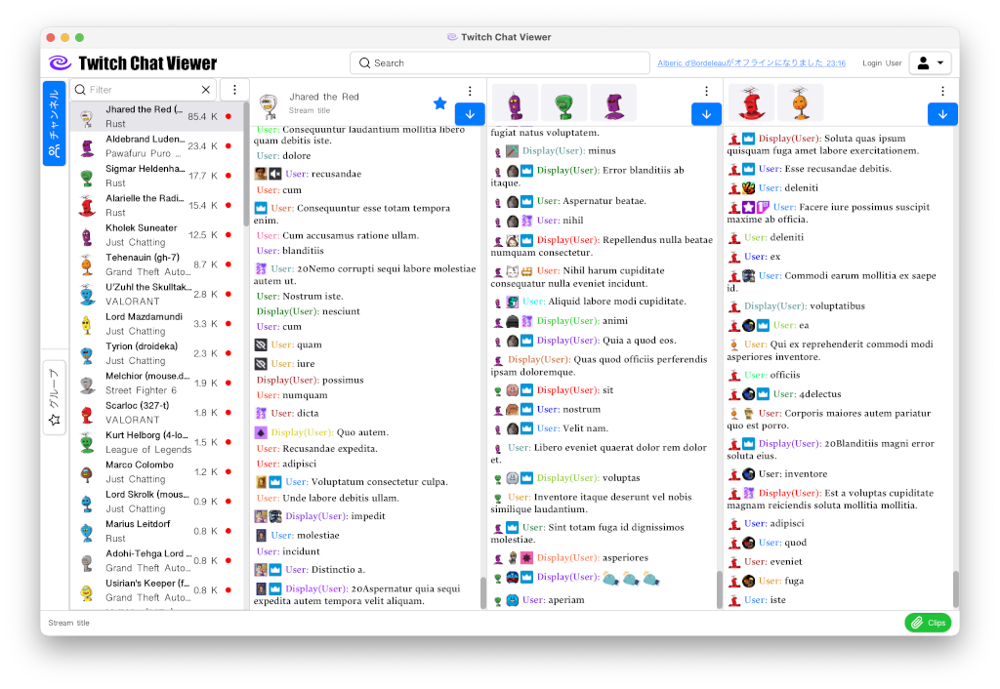
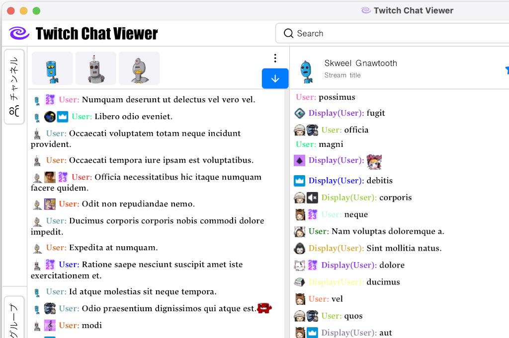
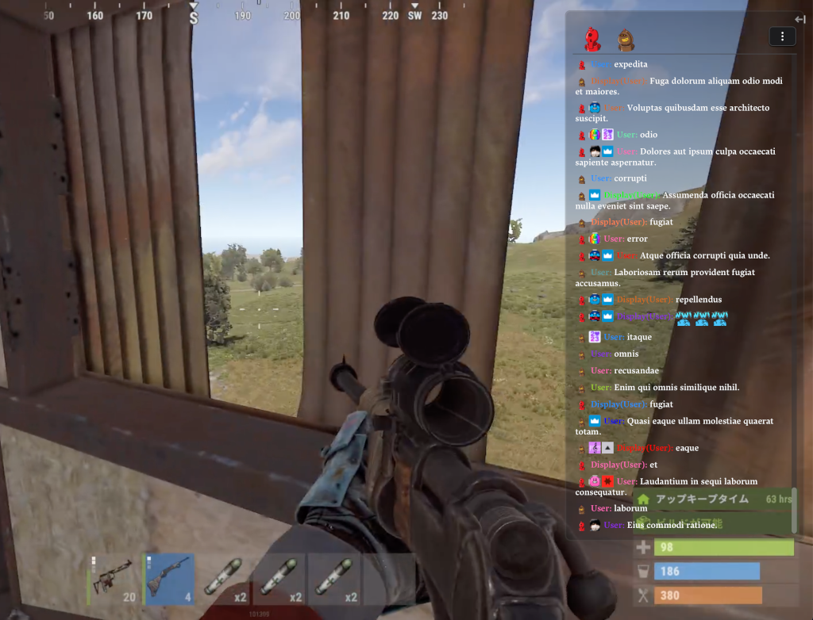
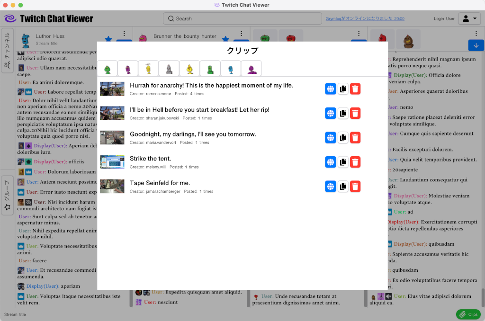
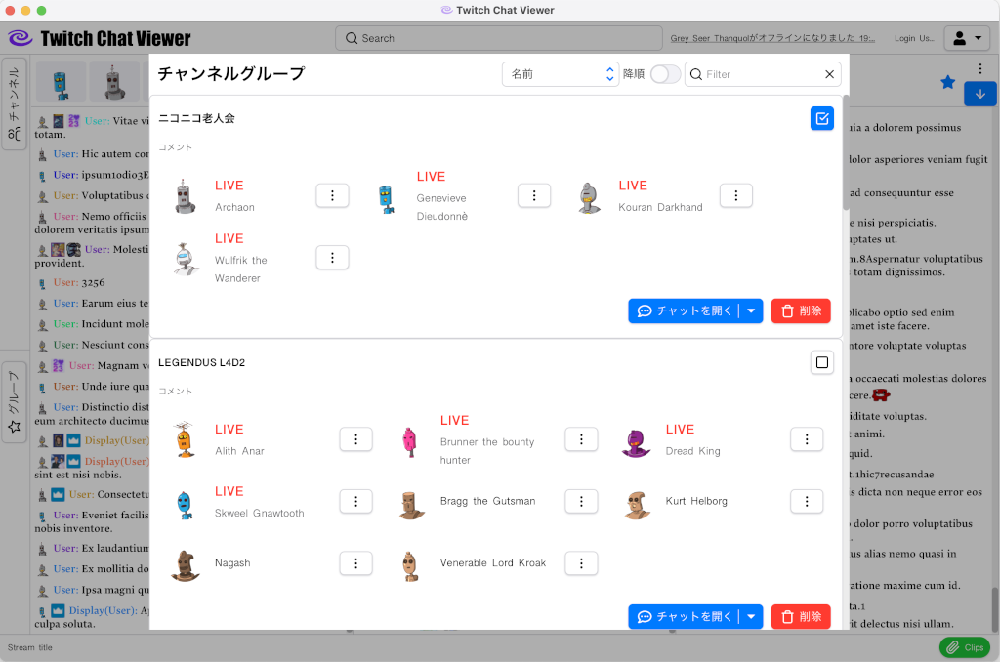

# Twitch Chat Viewer

このアプリケーションはライブストリーミングサービス[Twitch](https://www.twitch.tv/)の非公式チャットビューアです。

[使用方法](docs/usage.md)

## 主な機能

### マルチチャンネルのチャット閲覧
* 複数のチャンネルのチャットを同時に視聴できます。

### チャットのマージ
* 任意のチャットをマージして一つのビューアに集約できます。
  

### チャットビューアのポップアウト
* チャットビューアを透過ウインドウとしてポップアウトして最前面に配置できます。
* 配信画面や作業ウインドウの任意の場所に配置してスペースを有効活用しましょう。

### チャットに投稿されたクリップの検出
* 表示しているチャットに投稿されたクリップを検出できます。
* 投稿された回数を記録しており、ホットなクリップがひと目で確認できます。

### チャンネルのグループ管理
* チャンネルを任意のグループに登録することができます。

### カスタマイズ可能なチャットビューア
* フォントの変更やユーザー名・バッジの表示切り替えなど、チャットビューアをカスタマイズできます。
* 表示領域を最大限有効活用できます。

### チャットメッセージのフィルタリング
* 特定のユーザーのメッセージを非表示にしたり、正規表現を使用してフィルタリングできます。

## License

詳細は [LICENSE](LICENSE.md) を参照してください。