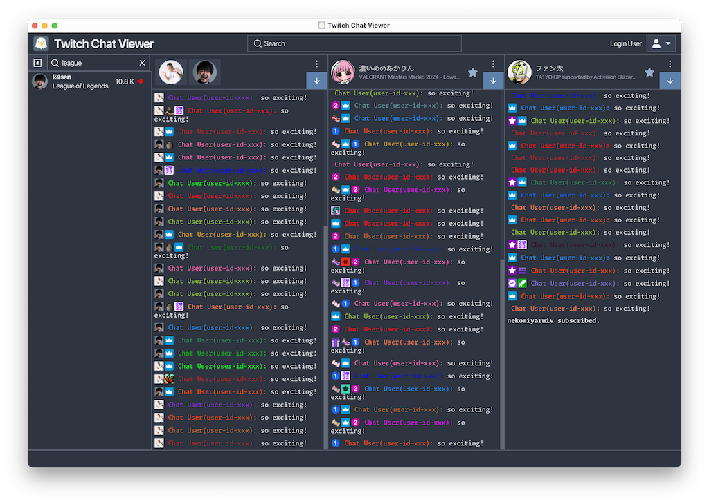
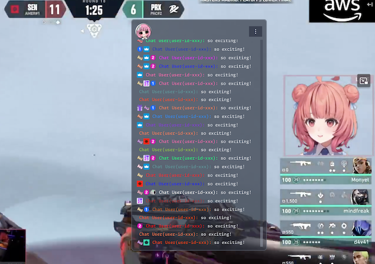
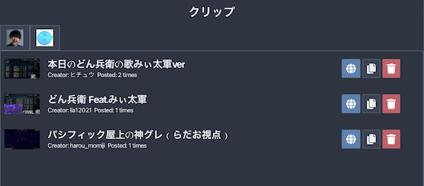

# Twitch Chat Viewer

このアプリケーションはライブストリーミングサービス[Twitch](https://www.twitch.tv/)の非公式チャットビューアです。
配信をより楽しく、快適に視聴することを目的としています！

## 主な機能

### マルチチャンネルのチャット閲覧
* 複数のチャンネルのチャットを同時に楽しむことができます。

### チャットのマージ
* 任意のチャットをマージして一つのビューアに集約できます。

### 透過ウインドウのポップアウト
* チャットビューアを透過ウインドウとしてポップアウトできます。
* 常に最前面に表示するオプションを使用して作業領域を妨げません。

### チャットに投稿されたクリップの検出
* 表示しているチャットに投稿されたクリップを検出できます。
* チャットに投稿されたクリップを見逃しません。

### カスタマイズ可能なチャットビューア
* フォントの変更やユーザー名・バッジの表示切り替えなど、チャットビューアをカスタマイズすることができます。
* 表示領域を最大限有効活用できます。

### チャットメッセージのフィルタリング
* 特定のユーザーのメッセージを非表示にしたり、正規表現を使用してフィルタリングすることができます。

## コアライブラリ

* [JavaFX](https://openjfx.io/) - UIコンポーネント
* [Twitch4J](https://twitch4j.github.io/) - Twitch APIのクライアント
* [AtlantaFX](https://mkpaz.github.io/atlantafx/) - モダンで美しいUIテーマ

### Icon

[FLAT ICON DESIGN](http://flat-icon-design.com/)

## License

詳細は [LICENSE](LICENSE.md) を参照してください。