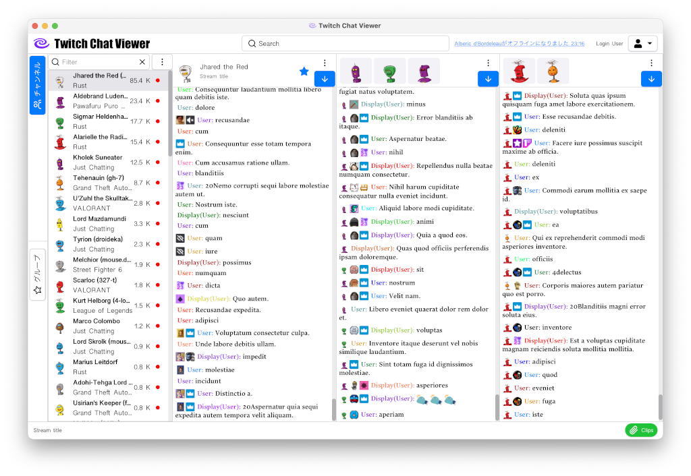

# アプリケーションの使用方法

## アプリケーションについて
本アプリケーションはライブストリーミングサービスTwitchのチャットビューアです。  
提供される機能はすべてTwitchが提供するAPIに基づいており、アンオフィシャルなものは使用していません。

## アプリケーションの取得
[リリースページ](https://github.com/k7t3/TwitchChatViewer/releases)より最新のビルドを取得できます。  
提供しているプラットフォームは以下の通りですが、動作の確認はWindows 11、macOS(Apple シリコン)のみ行っています。
### 提供プラットフォーム
| プラットフォーム| アーキテクチャ  | 動作確認 |
|--------------|---------------|------|
| Windows 11   | x86_64        | ✅    |
| macOS Sonoma | Intel         |      |
| macOS Sonoma | Apple silicon | ✅    |

## アプリケーションの起動
ダウンロードしたアプリケーションをインストールしてください。インストールしたアプリケーションを起動すると、OSやセキュリティソフトによって起動が制限される場合があります。  

## ユーザー認証
このアプリケーションはフォローしているチャンネルの一覧を取得するためにユーザー情報を必要とします。  
ログイン情報が保存されていない場合はアプリケーションの起動時に認証画面が表示されます。  

任意の方法でリンクを開くと、Twitchのアクティベートページが表示されます。  

アクティベートボタンを押すとアプリケーションに対してフォロー先のリストを読み込む許可を与えるページが表示されます。
このアプリケーションはフォローしているチャンネルの一覧を表示するためにその権利を必要としていますが、その情報の収集・保有はしていません。
詳細は[リポジトリ](https://github.com/k7t3/TwitchChatViewer)を参照してください。  

アプリケーションに対する許可を与えると、アプリケーションは自動的に認証画面を終了してメイン画面を表示します。  
